# Hypermarket Cheap

***Click this banner to load the website.***

Hypermarket sweep is a simple to use simulator for shopping. Preferably on your own, especially not your kids.
Gail Hinton is the manager of this store and she looks forward to welcoming you to her store in Wales.
"When you see the sheep, that's Hypermarket Cheap!" - Gail

**Play now and enjoy your shopping today!?**

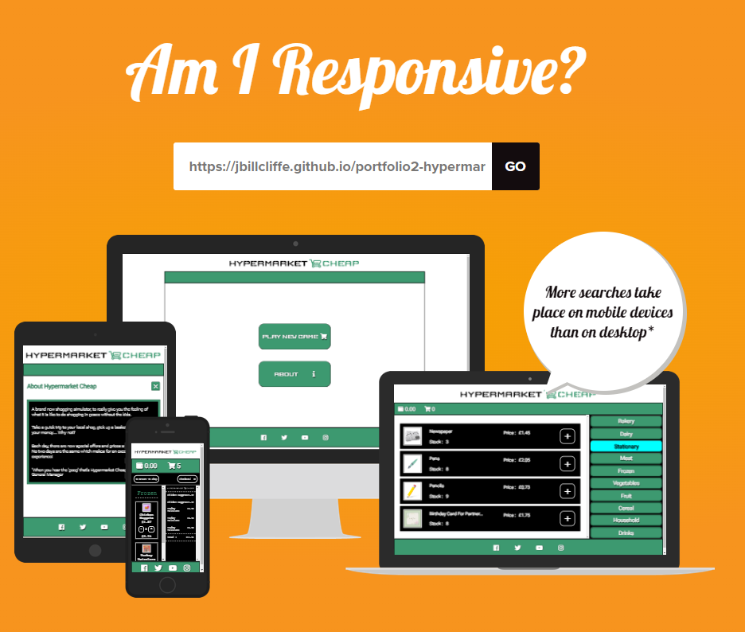

## User Experience Design

### Target Audience

- Just users looking to have a bit of escapist fun

### Website User Stories

- I want to find play straight away
    1. Simple interface, one button to click and you are in the game
    2. The objective is simple, the buttons labelled and it is intuitive in how users operate today with computers.
- I want replay value
    1. No game is the same!
    2. Each new game has a new pricing system, different allocation of special offers, different starting cash and stock levels
- I want to see my "achievements"
    1. A printed receipt at the end is a wonderful souvenir (is it?!)

### Wireframe Design

Wireframe was created using Figma[^1]. The wireframe includes initial function ideas and allocation of variables, functions and
how to apply a good flow to the program to ensure it is effective.

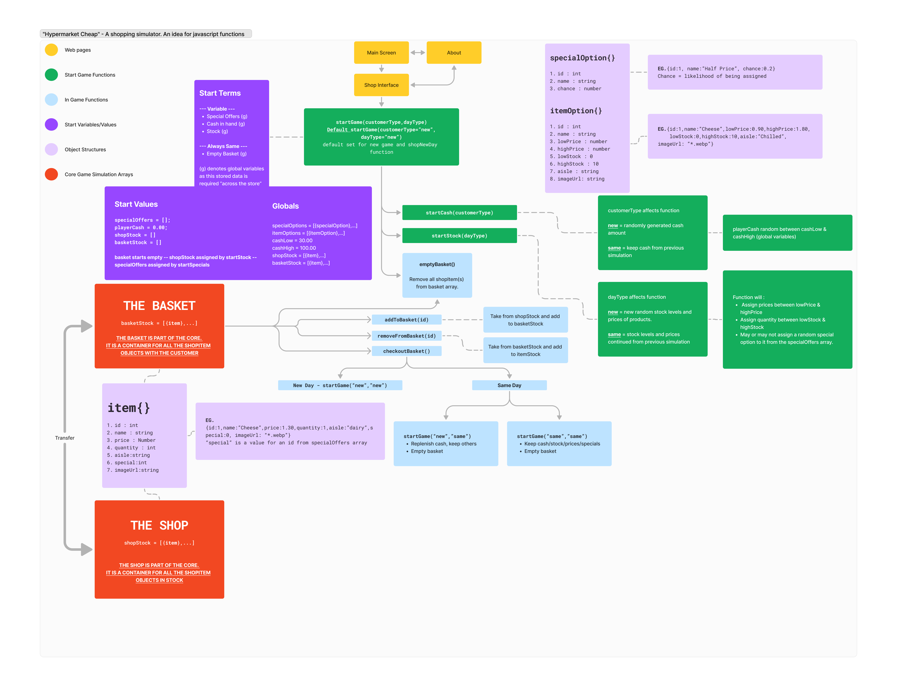

### Logo

The logo was created using the website LOGO.com.[^2]

#### Branding Including Logo

Full branding was provided at the end of the step-by-step development process.

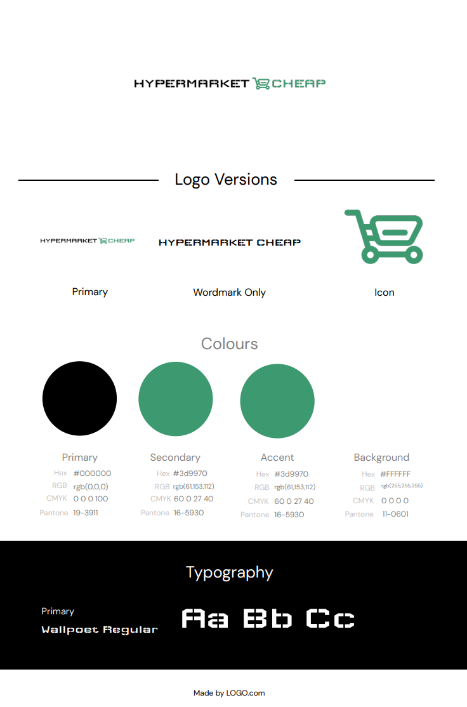

### Breakdown of Design

#### Colour Theme

Colour theme was initially chosen from the branding. But a darker green and cyan was used in the game also.
This was merely to achieve a better range for button hovers and backgrounds.

#### Typography

The font chosen, was initially based upon the font in the logo - "Wallpoet", a secondary font of Roboto was chosen as it was a very easy to read font.
Roboto, was then chosen as the main font as Wallpoet is hard to read at smaller sizes. It does remain in a couple of buttons and the logo.
A third font was introduced "Courier Prime" as I was looking to try and achieve a different look in the basket, similar to a receipt.
All of these are sourced from Google Fonts[^4].

## Features

### Features Wanted

- Basket empty at any time. The function is in place, just needs a button to activate the function independent of a new game.
- More special offers, algorithmic ones. Such as buy one get one free.
- More items/aisles, can never have too big a database and it could increase scope to not necessarily select all the items each time
  but instead have items that are rare, like a golden egg!
- More refactoring of code - A few I was able to compress, but there is so much more potential.
  Please see these images for refactoring examples:

    1. Before: addElementsToContainer() - [EG.1](readme/refactoring/add-elements-to-container.png)[EG.2](readme/refactoring/add-elements-to-container-2.png)
    2. After: 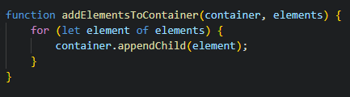
    3. Before: showElementArray()/hideElementArray() - [View](readme/refactoring/hide-and-show-elements.png)
    4. After: 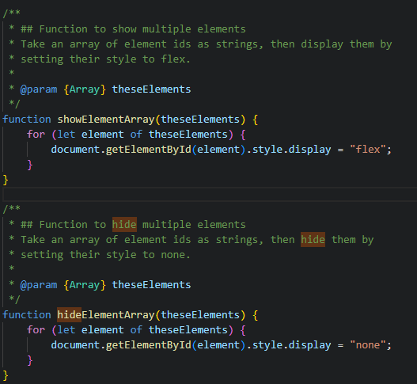
    5. Only after here : createNewReceiptLine()
        - 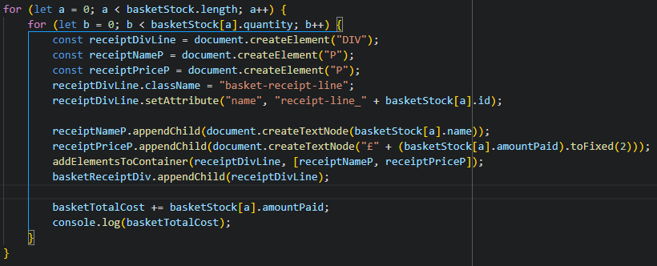
        Is called by : 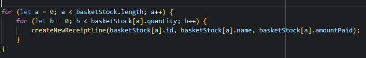

### Existing Features

#### Calculations

The program is able to make a lot of calculations at run time.

- Creating starting cash, stock and special offers are all random.
- It determines the stock when an item is added, removes it from the shop, deals with the cash and updates the amount of basket items!
- It will also then make assessments of what to do based on remaining stock. Such as changing classes to out of stock, removing buttons etc.
- It can tell you when you have run out of money. (Sorry). [View](readme/shop/out-of-money.png "Not enough money to purchase the item in the picture")
- It will alert you if you try to put something into your basket that is not available. [View](readme/shop/no-stock-alert.png "Can't add an item that is no longer in stock")

#### Clear Buttons

The buttons used have easy to read text on them, all with a text shadow to give extra emphasis.

##### Menu Buttons

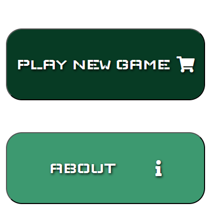

##### Aisle Buttons

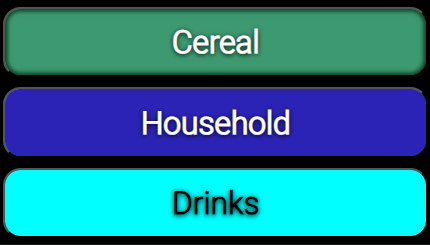

##### Add To Basket Buttons

#### Responsive Design

Each section of the application has been tested at key width values. 1200+px, 1200px, 900px, 768px, 600px, 480px, 320px and 280px.

##### Responsive -- The Menu

|  Width   |                                                                          |
| -------- | ------------------------------------------------------------------------ |
| 1200px   | [View](readme/menu/menu-1200.png "The menu at 1200px width resolution")  |
| 600px    | [View](readme/menu/menu-600.png "The menu at 600px width resolution")    |
| 480px    | [View](readme/menu/menu-480.png "The menu at 480px width resolution")    |
| 280px    | [View](readme/menu/menu-280.png "The menu at 280px width resolution")    |

##### Responsive -- About

|  Width   |                                                                          |
| -------- | ------------------------------------------------------------------------ |
| 1200px   | [View](readme/about/about-1200.png "The about page at 1200px width resolution")  |
| 900px    | [View](readme/about/about-900.png "The about page at 900px width resolution")    |
| 600px    | [View](readme/about/about-600.png "The about page at 600px width resolution")    |
| 320px    | [View](readme/about/about-320.png "The about page at 320px width resolution")    |
| 280px    | [View](readme/about/about-280.png "The about page at 280px width resolution")    |

##### Responsive -- The Shop

|  Width   |                                                                          |
| -------- | ------------------------------------------------------------------------ |
| 1200px   | [View](readme/shop/shop-1200.png "The shop at 1200px width resolution")  |
| 1024px   | [View](readme/shop/shop-1024.png "The shop at 1024px width resolution")  |
| 900px    | [View](readme/shop/shop-900.png "The shop at 900px width resolution")    |
| 768px    | [View](readme/shop/shop-768.png "The shop at 768px width resolution")    |
| 600px    | [View](readme/shop/shop-600.png "The shop at 600px width resolution")    |
| 480px    | [View](readme/shop/shop-480.png "The shop at 480px width resolution")    |
| 320px    | [View](readme/shop/shop-320.png "The shop at 320px width resolution")    |
| 280px    | [View](readme/shop/shop-280.png "The shop at 280px width resolution")    |

##### Responsive -- The Basket

|  Width   |                                                                                |
| -------- | ------------------------------------------------------------------------------ |
| 1200px   | [View](readme/basket/basket-1200.png "The basket at 1200px width resolution")  |
| 1024px   | [View](readme/basket/basket-1024.png "The basket at 1024px width resolution")  |
| 900px    | [View](readme/basket/basket-900.png "The basket at 900px width resolution")    |
| 768px    | [View](readme/basket/basket-768.png "The basket at 768px width resolution")    |
| 600px    | [View](readme/basket/basket-600.png "The basket at 600px width resolution")    |
| 480px    | [View](readme/basket/basket-480.png "The basket at 480px width resolution")    |
| 320px    | [View](readme/basket/basket-320.png "The basket at 320px width resolution")    |
| 280px    | [View](readme/basket/basket-280.png "The basket at 280px width resolution")    |

#### Galaxy Fold Resolution Drop (280px)

The website has been checked to ensure that it can resize down to the smallest available resolution for a mobile device (excluding watches).
Currently the Galaxy Zfold (3/4/5) which has a front screen resolution width of 280px

#### A printable receipt for you to take home

**By clicking the Checkout! button, you can get a printable version of the receipt!**

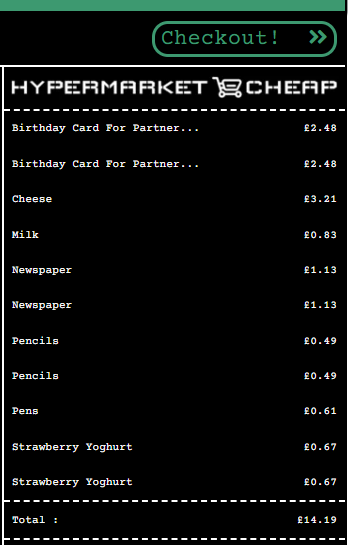

**A new printable document page is created**
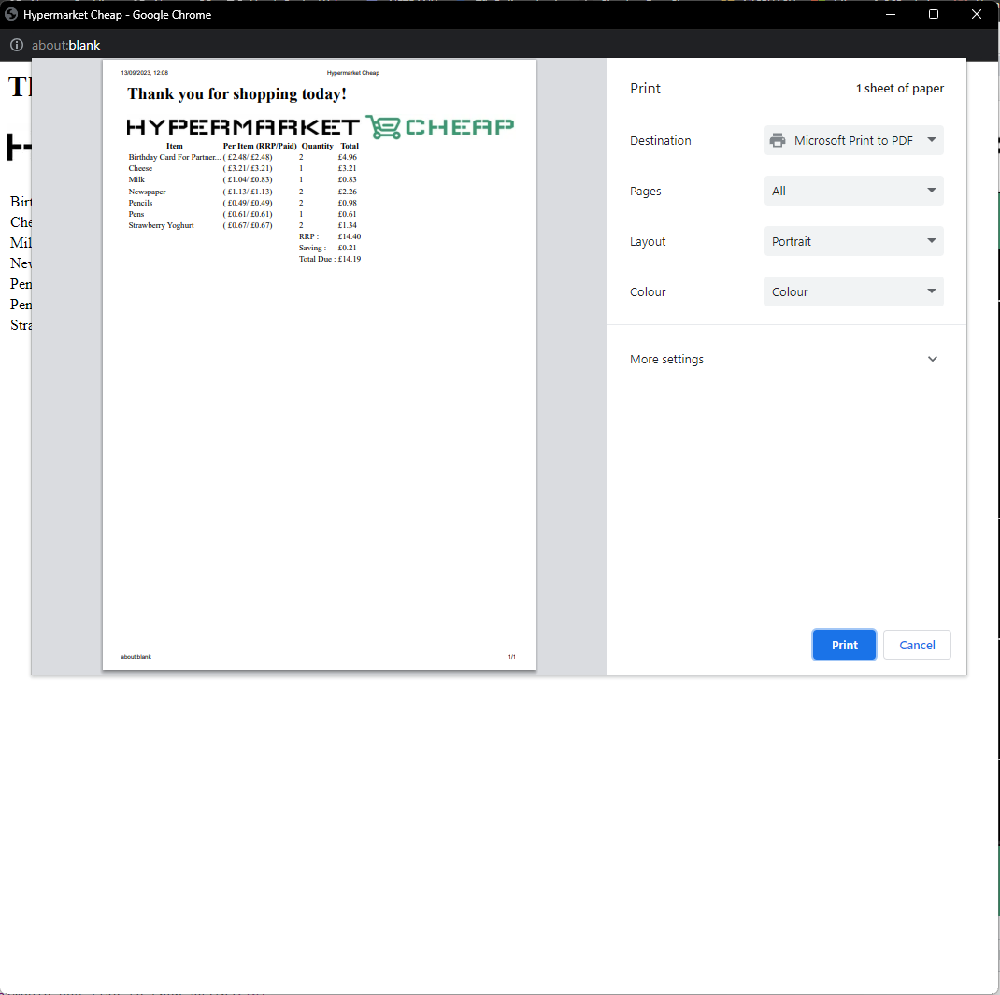

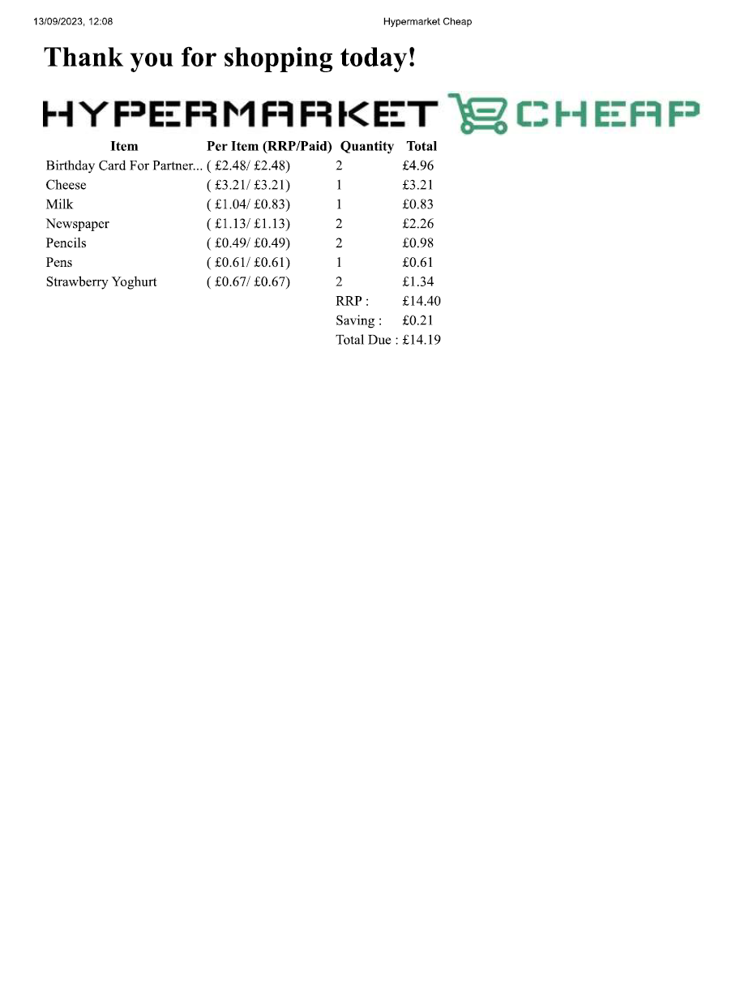

**[Download one here](readme/receipt/print-receipt.pdf "A pdf of a receipt")**

#### Footer

A responsive social media links area included in the footer which is present at all times, it scales the size of footer without compromising
the Fontawesome[^5] icons. Each one has an aria-label which describes where the link goes to and explains that it will open
in a separate window. The footer also includes the same blue hover as the menu, for consistency and clarity to the user.

#### Facebook

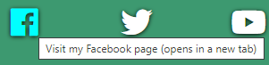

#### Twitter (Now "X/Twitter")

#### YouTube

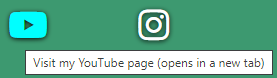

#### Instagram

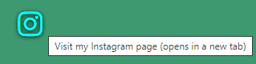

## Testing

## HTML and CSS Validation Tool

The W3C Markup Validation Service[^6] was used to validate the html. Things were all in place on the GitHub Pages for testing HTML.
For the CSS, I had to copy the full style.css. Results shown in the table below.

### CSS Validation - All Passed

Three CSS files to validate and main page is validated where all CSS files are referenced.

#### loading.css

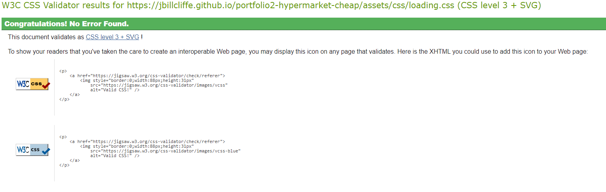

#### modal.css

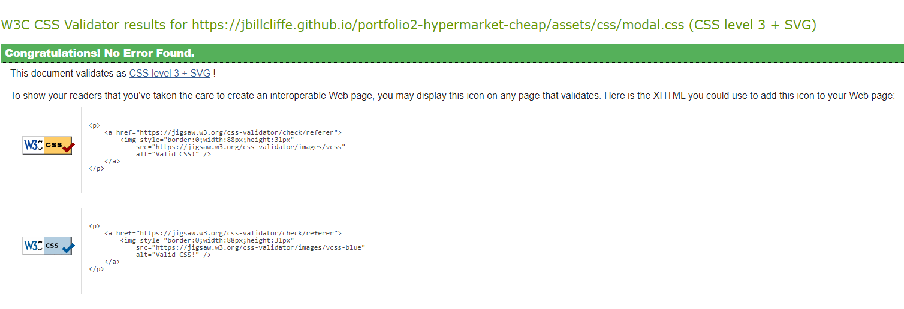

#### style.css

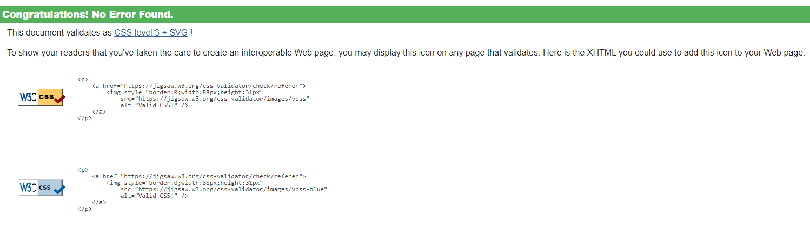

#### Overall

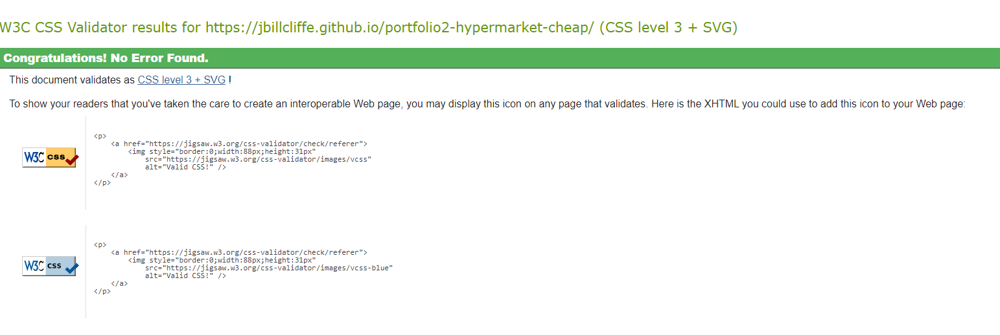

### HTML Validation -- All passed

Only one page for validation as everything is run within the index.html

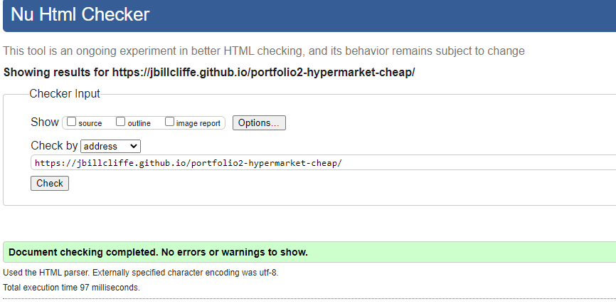

### HTML Validation Error

To start the validation failed, due to :

- Trailing /, which have been removed.
- Incorrect assignment of a variable in the "i" tag element.
  - The wallet which has an ::after associated with it to display player cash.

| Issue        | Resolution                                                                                   |
| -------------| ---------------------------------------------------------------------------------------------|
| Trailing /'s | Removing any unnecessary /'s on elements within the index.html page                          |
| i tag issue  | The problem was I forgot to assign it as "data-wallet-count", instead it was just "wallet-count" this was causing the issue, when I change this, all resolved                 |
| Duplicate Id | Inadvertently assigned the "about-screen" id twice, which the validator picked. Now resolved |

## WAVE, Google Chrome extension

WAVE is a measure of website issues. There was only one error. This was stating I was missing an alt on an image.
This too has been rectified.

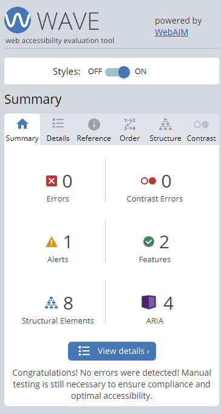

## Lighthouse, Google Chrome Inspect (F12) Mode

Scoring for Lighthouse was done on the Index (landing) page :
|  Page   |  Source        |                                                                                 |
| ------- | -------------- | ------------------------------------------------------------------------------- |
| Index   | Desktop/Mobile | [View](readme/lighthouse/lighthouse-score.png "Score on index.html")            |

The performance does not log as perfect by any means.
However, this is a game that has to load data in to work with. Unlike where a website speed can be key, people playing games,
on the whole understand that sometimes things take a little bit of time.

**HOWEVER!!**

When reloading, the JSON Specials[^7] and JSON Items[^8] are already in the cache and the following results occur :

Scoring for Lighthouse was done on the Index (landing) page, and what would be the most demanding page (contact.html) :
|  Page   |  Source |                                                                                                      |
| ------- | ------- | ---------------------------------------------------------------------------------------------------- |
| Index   | Desktop | [View](readme/lighthouse/lighthouse-desktop.png "Desktop Lighthouse score on index.html")     |
| Index   | Mobile  | [View](readme/lighthouse/lighthouse-mobile.png "Mobile Lighthouse score on index.html")       |

This is a noticeable difference, but it shows that the only issue is before the data is loaded.

## Further Testing

- The game was tested on Google Chrome, Microsoft Edge and Mozilla Firefox
- Although not viewed on multiple physical devices. Google Chrome's development console allows for a very large amount of emulated devices to be used.
- Repeated testing through each page, ensured functions were working correctly.

## Deployment

The steps below were followed to deploy the page to GitHub pages :

**From GitHub, click on the repository required :**

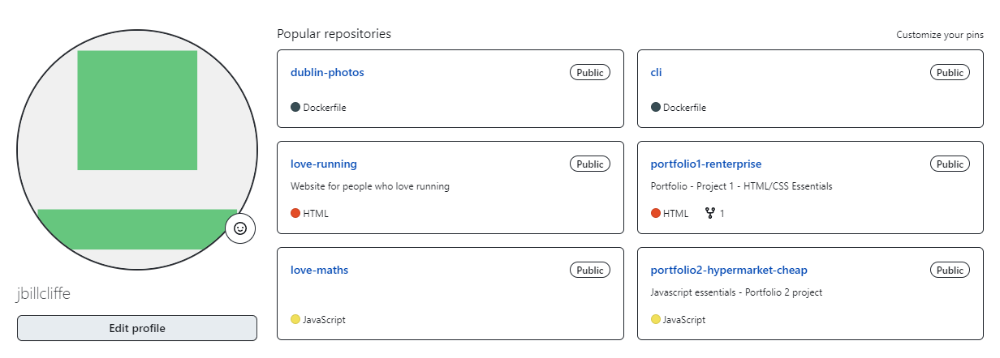

**As shown in the below image, click on the settings within the repository :**

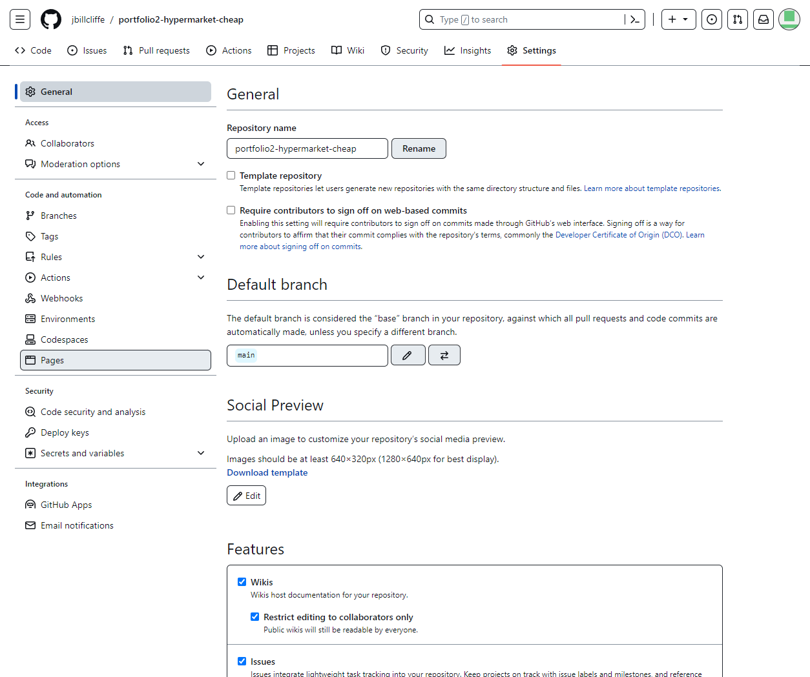

**Select "Pages, then select source "Deploy From Branch" and change Branch to "main" and select the "root" folder:**

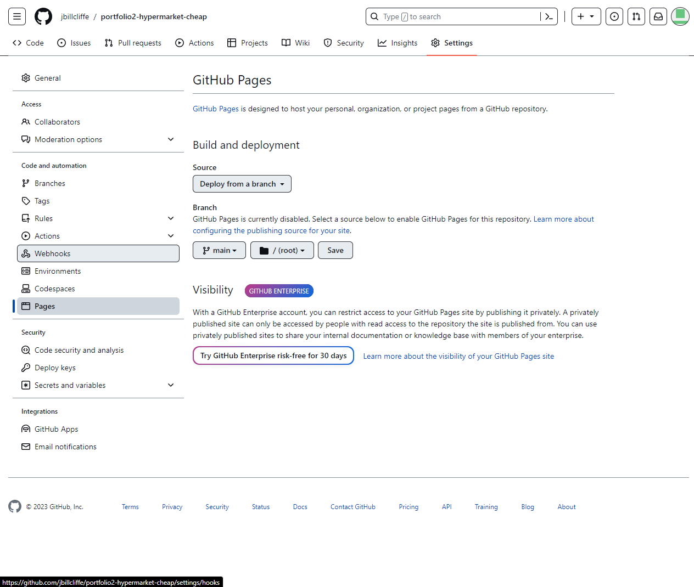

**After refreshing and viewing again, you should (there could be a delay in the upload process) have the link to the website (hosted by GitHub) where the project is viewable :**

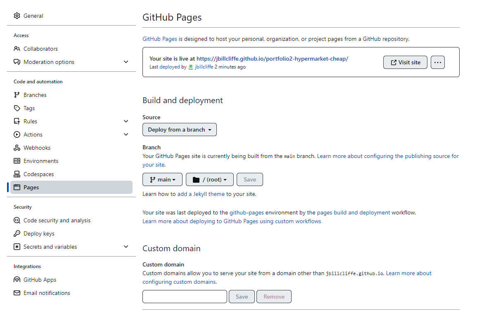

**[LIVE HYPERMARKET CHEAP WEBSITE](https://jbillcliffe.github.io/portfolio2-hypermarket-cheap/ "Go to Hypermarket Cheap")**

## Technologies Used

### Languages

- HTML5
- CSS3
- JavaScript
- jQuery

### Frameworks, Libraries & Programs Used

- Google Fonts[^4]
- Font Awesome[^17]
- Codeanywhere [^9]
- Figma[^1]
- Am I Responsive?[^10]

## Website Tutorials/References

Check if image exists function[^13]
CSS Loader[^14]
Create Element References[^15]
Change an ::after[^16]
For finding object by property value[^17]
Sort an object array[^18]
JavaScript some()[^19]

- W3Schools[^11] - Invaluable for providing details on elements and their attributes and so much HTML/CSS information.
- Image Resizer.com[^12] - Very useful for providing a way of cropping and resizing images. This was used for all
  of the items in the shop.
- Myself, The footer was reused (with minor style changes) from my first portfolio piece. This readme is also inspired
  by the original readme I did on portfolio 1. See other repository: Renterprise[^3]

## Images

Images are all located in the assets/images folder in the repository.
Images were all sourced for free:

| Image                             | Filename               |
|-----------------------------------|-------------------------|
| Bread[^20]                        | bread.webp              |
| Milk[^21]                         | milk.webp               |
| Cheese[^22]                       | cheese.webp             |
| Newspaper[^23]                    | newspaper.webp          |
| Beef Mince[^24]                   | beef-mince.webp         |
| Steak[^25]                        | steak.webp              |
| Pork Chops[^26]                   | pork-chops.webp         |
| Turkey Twizzlers[^27]             | turkey-twizzlers.webp   |
| Ice Creams[^28]                   | ice-creams.webp         |
| Chips[^29]                        | chips.webp              |
| Strawberry Yoghurt[^30]           | strawberry-yoghurt.webp |
| Cucumber[^31]                     | cucumber.webp           |
| Peppers[^32]                      | peppers.webp            |
| Tomatoes[^33]                     | tomatoes.webp           |
| Cabbage[^34]                      | cabbage.webp            |
| Iceberg Lettuce[^35]              | iceberg-lettuce.webp    |
| Apples[^36]                       | apples.webp             |
| Pears[^37]                        | pears.webp              |
| Watermelon[^38]                   | watermelon.webp         |
| Strawberries[^39]                 | strawberries.webp       |
| Corn Flakes[^40]                  | corn-flakes.webp        |
| Weetabix[^41]                     | weetabix.webp           |
| Coco Pops[^42]                    | coco-pops.webp          |
| Shredded Wheat[^43]               | shredded-wheat.webp     |
| Laundry Detergent[^44]            | laundry-detergent.webp  |
| Fabric Softener[^45]              | fabric-softener.webp    |
| Colour Catchers[^46]              | colour-catchers.webp    |
| Black Bin Bags[^47]               | black-bin-bags.webp     |
| Food Bin Bags[^48]                | food-bin-bags.webp      |
| Washing Up Liquid[^49]            | washing-up-liquid.webp  |
| Coca-Cola[^50]                    | coca-cola.webp          |
| Lemonade[^51]                     | lemonade.webp           |
| Ribena[^52]                       | ribena.webp             |
| Orange Squash[^53]                | orange-squash.webp      |
| Bottled Water[^54]                | bottled-water.webp      |
| Doughnuts[^55]                    | doughnuts.webp          |
| Chicken Nuggets[^56]              | chicken-nuggets.webp    |
| Chicken Breast[^57]               | chicken-breast.webp     |
| Pens[^58]                         | pens.webp               |
| Pencils[^59]                      | pencils.webp            |
| Birthday Card For Partner...[^60] | birthday-card.webp      |
| No Image [^61]                    | no-image.webp           |

## References

[^1]: Figma is a free website for designing storyboards and wireframes : https://www.figma.com/
[^2]: LOGO website used for creating a logo and branding from scratch for free : https://app.logo.com/
[^3]: Renterprise, my first portfolio piece : https://github.com/jbillcliffe/portfolio1-renterprise
[^4]: Google's font listing, a very large database of free online hosted fonts : https://fonts.google.com/
[^5]: Fontawesome a large database of free (and premium) icons : https://www.fontawesome.com
[^6]: W3 Validator : https://validator.w3.org/
[^7]: JSON file for all the special offers data so that it was not on the html page, it would been very untidy in that case. : assets/json/specials.json
[^8]: JSON file for all the shop item data so that it was not on the html page, it would been very untidy in that case. : assets/json/specials.json
[^9]: Cloud based IDE for development : https://app.codeanywhere.com/
[^10]: Am I Responsive? A Website designed to display a singular website at multiple resolutions : https://ui.dev/amiresponsive
[^11]: W3Schools, comprehensive database of information for HTML and CSS : https://www.w3schools.com/
[^12]: Image Resizer.com, Easily resize images online for free : https://imageresizer.com/
[^13]: Check if image exists function, best way of loading in images into the program : https://codepen.io/kallil-belmonte/pen/KKKRoyx
[^14]:CSS Loader - My CSS loader bar that obtained here royalty free : https://cssload.net/
[^15]: Create Element References - Was handy to see all the createElement() references in JavaScript : https://www.w3schools.com/jsref/
[^16]: Change an ::after pseudoclass. Was used in the toolbar for the wallet count: https://geeksforgeeks.org/how-to-update-properties-of-pseudo-element-after-and-before-using-javascript/
[^17]:For finding object by property value in an array : https://developer.mozilla.org/en-US/docs/Web/JavaScript/Reference/Global_Objects/Array/find
[^18]:Was required to sort an object array based on a value : https://www.w3schools.com/js/js_array_sort.asp
[^19]:some function, a useful tool for an array in javascript : https://www.w3schools.com/jsref/jsref_some.asp

### Image References

[^20]:Bread : https://www.vecteezy.com/free-vector/bread
[^21]:Milk : https://www.vecteezy.com/free-vector/milk
[^22]:Cheese : https://www.vecteezy.com/free-vector/cheese
[^23]:Newspaper : https://www.vecteezy.com/free-vector/newspaper
[^24]:Beef Mince : https://www.freepik.com/free-vector/raw-forcemeat-packaging-plastic-serving-tray-with-marking-minced-beef-realistic-mockup-vector-illustration_26765749
[^25]:Steak : https://www.vecteezy.com/free-vector/steak
[^26]:Pork Chops : https://www.vecteezy.com/free-vector/pork-chop
[^27]:Turkey Twizzlers : https://logos.fandom.com/wiki/Turkey_Twizzlers
[^28]:Ice creams : https://www.vecteezy.com/free-vector/ice-cream
[^29]:Chips : https://www.vecteezy.com/free-vector/fries
[^30]:Strawberry Yoghurt : https://www.vecteezy.com/free-vector/yogurt
[^31]:Cucumber : https://www.vecteezy.com/free-vector/cucumber
[^32]:Peppers : https://www.freepik.com/free-vector/red-green-yellow-peppers-graphic-illustration_2632386.htm
[^33]:Tomatoes : https://www.freepik.com/free-vector/fresh-organic-ripe-tomato_16263556.htm
[^34]:Cabbage : https://www.freepik.com/free-vector/vector-illustration-cabbage-colorful-gradient-mascot_32009946.htm
[^35]:Lettuce : https://https://pixabay.com/vectors/lettuce-salad-green-vegetables-295158/
[^36]:Apples : https://www.freepik.com/free-vector/apple-colorful-vector-design_38655651.htm
[^37]:Pears : https://www.freepik.com/free-vector/hand-drawn-pear-fruit-illustration_2582461.htm
[^38]:Watermelon : https://www.freepik.com/free-vector/fruity-realistic-design-concept-with-whole-watermelon-appetizing-juicy-slice-ripe-red-berry-transparent_6846642.htm
[^39]:Strawberries : https://www.freepik.com/free-vector/strawberry-fruit-design-illustration-abstract_36799189.htm
[^40]:Corn Flakes : https://www.freepik.com/free-vector/breakfast-cereals-realistic-composition_6414074.htm
[^41]:Weetabix : https://www.brandsoftheworld.com/logo/weetabix?original=1
[^42]:Coco Pops : https://pikeland.fandom.com/wiki/Coco_Pops_(Erisland)
[^43]:Shredded Wheat : https://www.istockphoto.com/search/2/image?phrase=shredded%20wheat%20isolated
[^44]:Laundry Detergent : https://www.vecteezy.com/free-vector/laundry-detergent
[^45]:Fabric Softener : https://www.vecteezy.com/free-vector/fabric-softener
[^46]:Colour Catchers : https://www.vecteezy.com/free-vector/laundry
[^47]:Black Bin Bags : https://www.vecteezy.com/free-vector/hat
[^48]:Food Bin Bags : https://www.vecteezy.com/free-vector/plastic
[^49]:Washing Up Liquid : https://www.vecteezy.com/free-vector/washing-up-liquid
[^50]:Coca Cola : https://www.vecteezy.com/free-vector/coca-cola
[^51]:Lemonade : https://www.vecteezy.com/free-vector/lemonade
[^52]:Ribena : https://www.vecteezy.com/free-vector/illustration
[^53]:Orange Squash : https://www.freepik.com/free-vector/orange-juice-healthy-drink-glass-citrus-fruit-with-leaf-emblem_4619078.htm
[^54]:Bottled Water : https://www.freepik.com/free-vector/bottle-water-concept-illustration_8476696.htm
[^55]:Doughnuts : https://www.freepik.com/free-vector/coloured-pattern-design_902728.htm
[^56]:Chicken Nuggets : https://www.freepik.com/free-vector/cute-nuggets-smile-with-sauce-cartoon-vector-icon-illustration-food-object-icon-flat-cartoon-style_23252229.htm
[^57]:Chicken Breast : https://www.freepik.com/free-photo/knife-napkin-near-chicken-fillet_1891679.htm
[^58]:Pens : https://www.freepik.com/free-vector/illustration-pen-icon_2606110.htm
[^59]:Pencils : https://www.freepik.com/free-vector/writting-pencil-design_850418.htm
[^60]:Birthday Card For Partner... : https://www.freepik.com/free-vector/happy-birthday-blooming-flowers-card_9989696.htm
[^61]:Image Not Found (No Image) : https://www.vecteezy.com/vector-art/5337799-icon-image-not-found-vector
